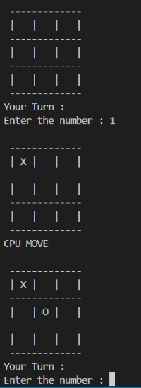
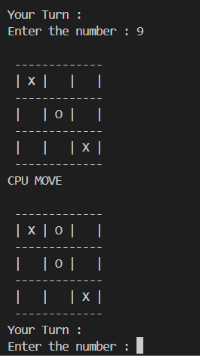
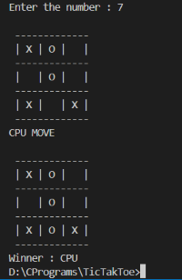

# 💪UnBeatable TicTacToe [Backtracking]
----


❌|⭕|⭕
-|-|-
⭕|❌|
❌|⭕|❌


``
This C++ program uses backtracking algorithm to find best possible move by 
calculation winning and loosing probabilities of each move it does and eventually
selecting the best possible move.
``

### 🔥 Features:
1. Properly Modularised.
1. Optimized.
1. Always Wins or Draws
1. Randomised Moves so it doesn't feels same

## Steps to Use
1. Include game Include file after downlaoding...
```cpp
#include "TicTacToe/Game.cpp"
```
2. Create the Object
```cpp
Game *g = new Game(3,userPlayFirst=true);
```
`Note : Do Not Use n greater than 3 or it may take a day for CPU 🤡 to play his chance`
3. Execute Play
```cpp
g->play();
```
Note : `srand(time(0));` for randomly choosing from equal possibilities

## Code to run [Included]

``` cpp
#include <bits/stdc++.h>
#include "TicTacToe/Game.cpp"
using namespace std;
int main()
{
    srand(time(0));
    Game *g = new Game(3,userPlayFirst=true);
    g->play();
    return 0;
}
```

## Code To Play
```
g++ play.cpp -o play.exe
play.exe
```
`To Input Consider the grid from 1 to 9 and enter from keyboard`
## Preview

<br/>

<br/>
